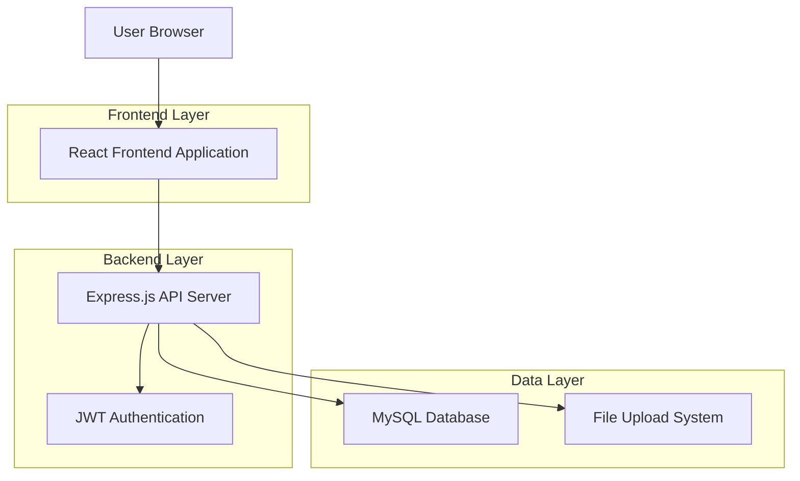
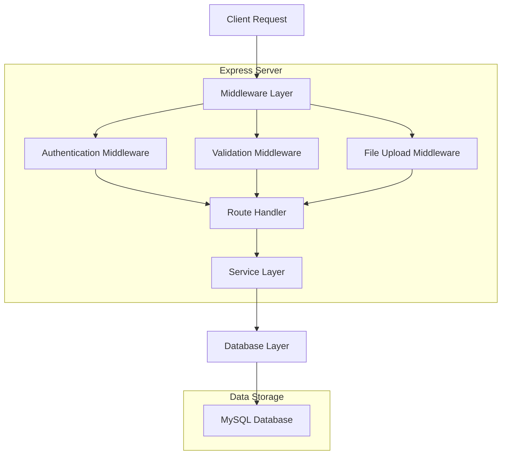
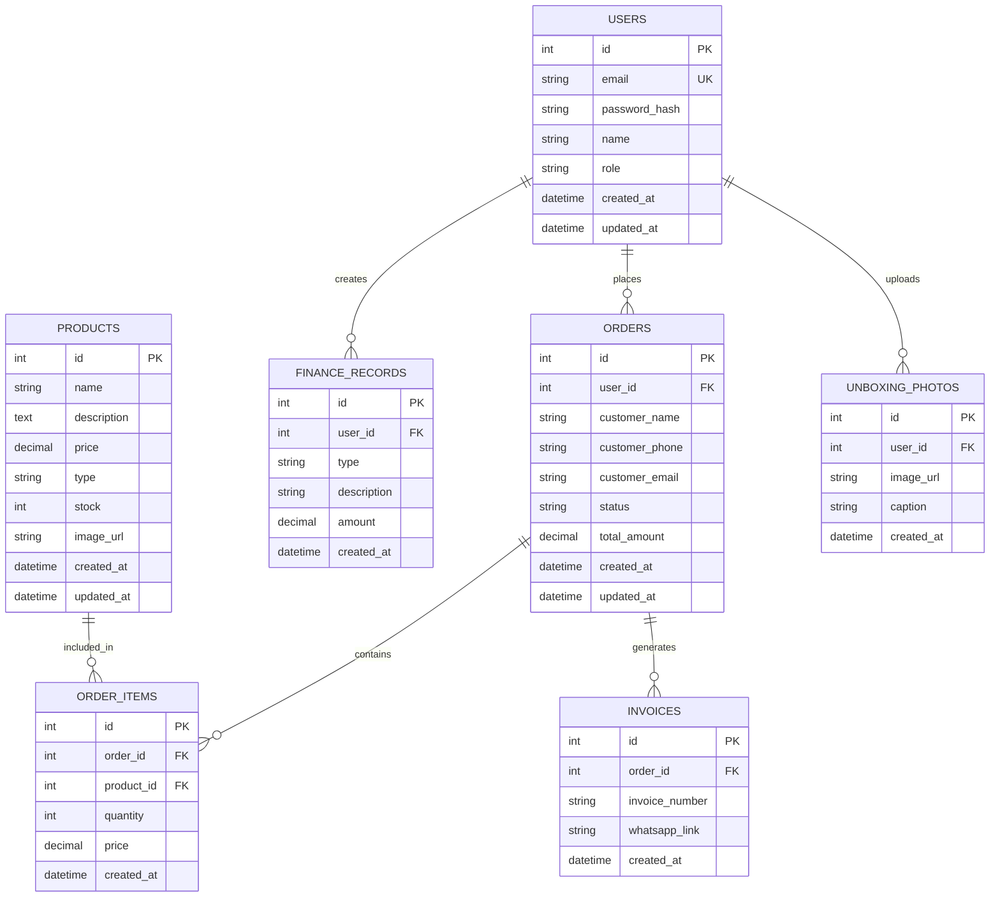

## 1. Architecture Design



## 2. Technology Description

- **Frontend**: React@18 + CSS3 + JavaScript ES6
- **Backend**: Node.js@18 + Express@4
- **Database**: MySQL@8
- **Authentication**: JWT + bcrypt
- **File Upload**: multer
- **Testing**: supertest
- **Initialization Tool**: create-react-app (frontend), npm init (backend)

## 3. Route Definitions

### Frontend Routes
| Route | Purpose |
|-------|---------|
| / | Home page, displays product catalog |
| /product/:id | Product detail page with full information |
| /cart | Shopping cart with order summary |
| /gallery | Unboxing photo gallery |
| /login | User authentication page |
| /admin/dashboard | Admin dashboard with management tools |
| /admin/products | Product management interface |
| /admin/orders | Order management and status updates |
| /admin/finance | Financial records and reporting |
| /admin/invoices | Invoice generation with WhatsApp integration |

### Backend API Routes
| Route | Purpose |
|-------|---------|
| POST /api/auth/login | User authentication |
| POST /api/auth/register | User registration |
| GET /api/products | Retrieve all products |
| GET /api/products/:id | Retrieve specific product |
| POST /api/products | Create new product (admin) |
| PUT /api/products/:id | Update product (admin) |
| DELETE /api/products/:id | Delete product (admin) |
| GET /api/orders | Retrieve orders |
| POST /api/orders | Create new order |
| PUT /api/orders/:id/status | Update order status |
| GET /api/finance | Retrieve financial records |
| POST /api/finance | Create financial record |
| GET /api/unboxing | Retrieve unboxing photos |
| POST /api/unboxing/upload | Upload unboxing photo |
| GET /api/invoices | Retrieve invoices |
| POST /api/invoices/generate | Generate invoice with WhatsApp link |

## 4. API Definitions

### 4.1 Authentication API

**Login Endpoint**
```
POST /api/auth/login
```

Request:
| Param Name | Param Type | isRequired | Description |
|------------|------------|------------|-------------|
| email | string | true | User email address |
| password | string | true | User password |

Response:
| Param Name | Param Type | Description |
|------------|------------|-------------|
| token | string | JWT authentication token |
| user | object | User data (id, email, role) |
| success | boolean | Authentication status |

Example:
```json
{
  "email": "admin@kpopstore.com",
  "password": "securepassword123"
}
```

### 4.2 Product API

**Create Product**
```
POST /api/products
```

Request:
| Param Name | Param Type | isRequired | Description |
|------------|------------|------------|-------------|
| name | string | true | Product name |
| description | string | true | Product description |
| price | number | true | Product price |
| type | string | true | Product type (PO/Ready) |
| stock | number | true | Available stock quantity |
| image | file | false | Product image file |

Response:
| Param Name | Param Type | Description |
|------------|------------|-------------|
| product | object | Created product data |
| success | boolean | Operation status |

### 4.3 Order API

**Create Order**
```
POST /api/orders
```

Request:
| Param Name | Param Type | isRequired | Description |
|------------|------------|------------|-------------|
| customer_name | string | true | Customer name |
| customer_phone | string | true | Customer phone number |
| customer_email | string | true | Customer email |
| items | array | true | Array of order items |
| total_amount | number | true | Total order amount |

Response:
| Param Name | Param Type | Description |
|------------|------------|-------------|
| order | object | Created order data |
| order_id | string | Unique order identifier |
| success | boolean | Operation status |

### 4.4 Invoice API

**Generate Invoice**
```
POST /api/invoices/generate
```

Request:
| Param Name | Param Type | isRequired | Description |
|------------|------------|------------|-------------|
| order_id | string | true | Order ID |
| customer_phone | string | true | Customer WhatsApp number |

Response:
| Param Name | Param Type | Description |
|------------|------------|-------------|
| invoice | object | Generated invoice data |
| whatsapp_link | string | WhatsApp message link |
| success | boolean | Operation status |

## 5. Server Architecture Diagram



## 6. Data Model

### 6.1 Database Schema



### 6.2 Data Definition Language

**Users Table**
```sql
CREATE TABLE users (
    id INT PRIMARY KEY AUTO_INCREMENT,
    email VARCHAR(255) UNIQUE NOT NULL,
    password_hash VARCHAR(255) NOT NULL,
    name VARCHAR(100) NOT NULL,
    role ENUM('customer', 'admin') DEFAULT 'customer',
    created_at TIMESTAMP DEFAULT CURRENT_TIMESTAMP,
    updated_at TIMESTAMP DEFAULT CURRENT_TIMESTAMP ON UPDATE CURRENT_TIMESTAMP
);
```

**Products Table**
```sql
CREATE TABLE products (
    id INT PRIMARY KEY AUTO_INCREMENT,
    name VARCHAR(255) NOT NULL,
    description TEXT,
    price DECIMAL(10,2) NOT NULL,
    type ENUM('PO', 'Ready') NOT NULL,
    stock INT DEFAULT 0,
    image_url VARCHAR(500),
    created_at TIMESTAMP DEFAULT CURRENT_TIMESTAMP,
    updated_at TIMESTAMP DEFAULT CURRENT_TIMESTAMP ON UPDATE CURRENT_TIMESTAMP
);
```

**Orders Table**
```sql
CREATE TABLE orders (
    id INT PRIMARY KEY AUTO_INCREMENT,
    user_id INT,
    customer_name VARCHAR(100) NOT NULL,
    customer_phone VARCHAR(20) NOT NULL,
    customer_email VARCHAR(255) NOT NULL,
    status ENUM('pending', 'packing', 'shipped', 'completed') DEFAULT 'pending',
    total_amount DECIMAL(10,2) NOT NULL,
    created_at TIMESTAMP DEFAULT CURRENT_TIMESTAMP,
    updated_at TIMESTAMP DEFAULT CURRENT_TIMESTAMP ON UPDATE CURRENT_TIMESTAMP,
    FOREIGN KEY (user_id) REFERENCES users(id)
);
```

**Order Items Table**
```sql
CREATE TABLE order_items (
    id INT PRIMARY KEY AUTO_INCREMENT,
    order_id INT NOT NULL,
    product_id INT NOT NULL,
    quantity INT NOT NULL,
    price DECIMAL(10,2) NOT NULL,
    created_at TIMESTAMP DEFAULT CURRENT_TIMESTAMP,
    FOREIGN KEY (order_id) REFERENCES orders(id),
    FOREIGN KEY (product_id) REFERENCES products(id)
);
```

**Invoices Table**
```sql
CREATE TABLE invoices (
    id INT PRIMARY KEY AUTO_INCREMENT,
    order_id INT NOT NULL,
    invoice_number VARCHAR(50) UNIQUE NOT NULL,
    whatsapp_link VARCHAR(500),
    created_at TIMESTAMP DEFAULT CURRENT_TIMESTAMP,
    FOREIGN KEY (order_id) REFERENCES orders(id)
);
```

**Unboxing Photos Table**
```sql
CREATE TABLE unboxing_photos (
    id INT PRIMARY KEY AUTO_INCREMENT,
    user_id INT NOT NULL,
    image_url VARCHAR(500) NOT NULL,
    caption TEXT,
    created_at TIMESTAMP DEFAULT CURRENT_TIMESTAMP,
    FOREIGN KEY (user_id) REFERENCES users(id)
);
```

**Finance Records Table**
```sql
CREATE TABLE finance_records (
    id INT PRIMARY KEY AUTO_INCREMENT,
    user_id INT NOT NULL,
    type ENUM('income', 'expense') NOT NULL,
    description TEXT,
    amount DECIMAL(10,2) NOT NULL,
    created_at TIMESTAMP DEFAULT CURRENT_TIMESTAMP,
    FOREIGN KEY (user_id) REFERENCES users(id)
);
```

**Sample Data Insertion**
```sql
-- Insert admin user
INSERT INTO users (email, password_hash, name, role) VALUES 
('admin@kpopstore.com', '$2b$10$92IXUNpkjO0rOQ5byMi.Ye4oKoEa3Ro9llC/.og/at2.uheWG/igi', 'Admin User', 'admin');

-- Insert sample products
INSERT INTO products (name, description, price, type, stock) VALUES 
('BTS Album', 'Latest BTS album with photocard', 250000, 'Ready', 50),
('Blackpink Lightstick', 'Official Blackpink lightstick ver.2', 450000, 'PO', 0);
```