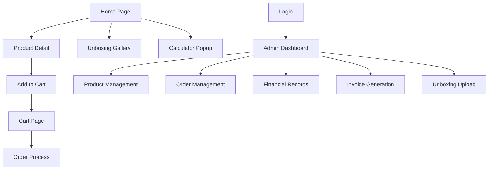

## 1. Product Overview
A full-stack K-Pop merchandise e-commerce platform that enables fans to browse and purchase authentic K-Pop products. The platform serves both public customers and administrators, providing a seamless shopping experience with comprehensive order management and financial tracking.

Target market: K-Pop fans worldwide seeking authentic merchandise with reliable order tracking and admin management tools.

## 2. Core Features

### 2.1 User Roles
| Role | Registration Method | Core Permissions |
|------|---------------------|------------------|
| Customer | Email registration | Browse products, place orders, view order history, access calculator |
| Admin | Manual creation by system admin | Manage products, orders, finances, upload unboxing photos, generate invoices |

### 2.2 Feature Module
Our K-Pop merchandise platform consists of the following main pages:
1. **Home page**: Product showcase with PO and Ready Stock categories, featured items.
2. **Product detail page**: Detailed product information, pricing, add to cart functionality.
3. **Cart page**: Order summary, quantity management, total calculation.
4. **Calculator popup**: Quick price calculation tool accessible from any page.
5. **Unboxing gallery**: Photo gallery showcasing customer unboxing experiences.
6. **Login page**: User authentication for customers and admin access.
7. **Admin dashboard**: Product management, order tracking, financial records, invoice generation.
8. **Order management**: Status updates (pending, packing, shipped, completed).
9. **Invoice generation**: Automatic WhatsApp link creation for customer communication.

### 2.3 Page Details
| Page Name | Module Name | Feature description |
|-----------|-------------|---------------------|
| Home page | Product showcase | Display PO and Ready Stock products with categories, search and filter options |
| Home page | Navigation | Top navigation bar with cart icon, login button, calculator access |
| Product detail | Product information | Show product images, description, price, availability status, add to cart button |
| Cart page | Order summary | List selected items with quantities, calculate total price, proceed to checkout |
| Calculator | Price calculator | Popup modal with basic arithmetic functions for price calculations |
| Gallery | Unboxing photos | Grid layout of customer unboxing photos with upload capability for admin |
| Login | Authentication | Email/password login with JWT token generation and localStorage management |
| Admin dashboard | Product management | CRUD operations for products, inventory tracking, PO/Ready stock categorization |
| Admin dashboard | Order management | View all orders, update status (pending/packing/shipped/completed), customer details |
| Admin dashboard | Financial records | Track income, expenses, profit calculations with date filtering |
| Admin dashboard | Invoice generation | Create invoices with automatic WhatsApp link generation for customer contact |

## 3. Core Process
### Customer Flow
1. Browse homepage to view available K-Pop merchandise
2. Click on product to view detailed information
3. Add desired items to shopping cart
4. Access calculator popup for price calculations
5. View cart and proceed with order
6. Browse unboxing gallery for product experiences
7. Track order status through customer portal

### Admin Flow
1. Login to admin dashboard with secure credentials
2. Manage product inventory (add/edit/delete products)
3. Process customer orders and update shipping status
4. Upload unboxing photos to gallery
5. Generate invoices with WhatsApp integration
6. Monitor financial records and business performance

## 4. User Interface Design

### 4.1 Design Style
- **Primary colors**: K-Pop inspired palette with vibrant purple (#9B59B6) and pink (#E91E63) accents
- **Secondary colors**: Clean white background (#FFFFFF) with dark gray text (#333333)
- **Button style**: Rounded corners with gradient backgrounds, hover effects for interactivity
- **Font**: Modern sans-serif (Roboto/Poppins) with clear hierarchy: Headers 24-32px, Body 14-16px
- **Layout style**: Card-based product display, responsive grid system, sticky navigation
- **Icons**: K-Pop themed emoji and custom icons for merchandise categories

### 4.2 Page Design Overview
| Page Name | Module Name | UI Elements |
|-----------|-------------|-------------|
| Home page | Product showcase | Card-based grid layout with product images, hover effects show quick view, filter sidebar for PO/Ready stock |
| Product detail | Image gallery | Large product images with thumbnail navigation, zoom on hover, product specs in organized tabs |
| Cart page | Order summary | Clean table layout with item images, quantity selectors, prominent total display, checkout button |
| Calculator | Modal popup | Compact calculator interface with basic operations, draggable modal, close on outside click |
| Gallery | Photo grid | Masonry layout for unboxing photos, lightbox view on click, upload button for admin |
| Admin dashboard | Management panels | Tabbed interface for different sections, data tables with action buttons, form modals for CRUD |
| Invoice | Generation form | Pre-filled customer data, editable fields, WhatsApp link preview, print-friendly layout |

### 4.3 Responsiveness
Desktop-first design approach with mobile adaptation. Touch-optimized interactions for mobile users, collapsible navigation menu, responsive product grids that adapt from 4 columns (desktop) to 1 column (mobile).